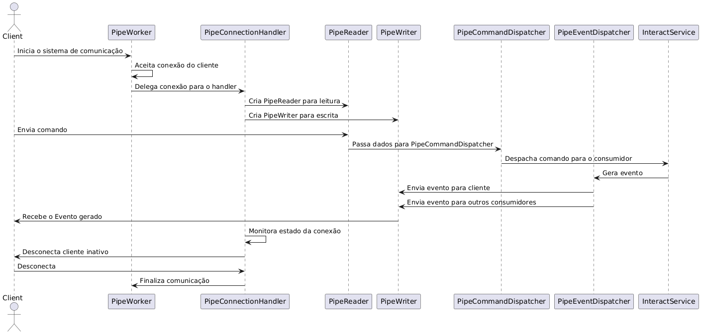

# Comunicação via Pipes Nomeados 
Descrição geral sobre a Comunicação IPC e seus componentes. 
## 📖 Arquitetura Geral

O sistema é composto por três principais componentes de gerenciamento:

* [PipeCommandDispatcher](/Solution/Nexus.Music.Choice.Worker/PipeHandler/PipeCommandDispatcher.cs): Responsável por gerenciar e despachar comandos recebidos de streams de leitura ([PipeReader](/Solution/Nexus.Music.Choice.Worker/PipeHandler/PipeReader.cs)).
* [PipeEventDispatcher](/Solution/Nexus.Music.Choice.Worker/PipeHandler/PipeEventDispatcher.cs): Responsável por gerenciar e despachar eventos para streams de escrita ([PipeWriter](/Solution/Nexus.Music.Choice.Worker/PipeHandler/PipeWriter.cs)).
* [PipeConnectionHandler](/Solution/Nexus.Music.Choice.Worker/PipeHandler/PipeConnectionHandler.cs): Gerencia as conexões de clientes via Named Pipes, registrando streams de leitura e escrita e monitorando o estado das conexões.

Esses componentes trabalham em conjunto para permitir a comunicação bidirecional (full-duplex) entre processos, garantindo que comandos possam ser recebidos enquanto eventos são enviados simultaneamente.

## 📦 Componentes e Responsabilidades

### [PipeCommandDispatcher](/Solution/Nexus.Music.Choice.Worker/PipeHandler/PipeCommandDispatcher.cs)

* **Base**: Herda de [BaseCommandDispatcher](/Solution/Nexus.Music.Choice.Worker/Base/Dispatcher/BaseCommandDispatcher.cs) e implementa [ICommandDispatcher](/Solution/Nexus.Music.Choice.Worker/Base/Dispatcher/ICommandDispatcher.cs).
* **Função**: Gerencia streams de leitura ([PipeReader](/Solution/Nexus.Music.Choice.Worker/PipeHandler/PipeReader.cs)) e despacha comandos recebidos para os consumidores registrados.
* **Eventos**: `CommandReceived` (disparado quando um comando é recebido).
* **Dependências**: `ILogger<PipeCommandDispatcher>`, [IInteractionService](/Solution/Nexus.Music.Choice.Worker/Interfaces/IInteractionService.cs).

### [PipeEventDispatcher](/Solution/Nexus.Music.Choice.Worker/PipeHandler/PipeEventDispatcher.cs)

* **Base**: Herda de [BaseDispatcher](/Solution/Nexus.Music.Choice.Worker/Base/Dispatcher/BaseDispatcher.cs) e implementa `IEventDispatcher<T>`.
* **Função**: Gerencia streams de escrita ([PipeWriter](/Solution/Nexus.Music.Choice.Worker/PipeHandler/PipeWriter.cs)) e despacha eventos para os consumidores registrados.
* **Métodos**: `DispatchEvent(Event @event)` (envia eventos para todos os streams registrados).
* **Dependências**: `ILogger<PipeEventDispatcher>`.

### [PipeConnectionHandler](/Solution/Nexus.Music.Choice.Worker/PipeHandler/PipeConnectionHandler.cs)

* **Interface**: Implementa `IPipeConnectionHandler` e `IDisposable`.
* **Função**: Gerencia conexões de clientes via Named Pipes.
* **Principais Responsabilidades**: Aceitar conexões, criar/registrar [PipeReader](/Solution/Nexus.Music.Choice.Worker/PipeHandler/PipeReader.cs) e [PipeWriter](/Solution/Nexus.Music.Choice.Worker/PipeHandler/PipeWriter.cs), monitorar estado e desconectar clientes quando necessário.
* **Dependências**: `ILogger<PipeConnectionHandler>`, `ICommandDispatcher<PipeReader>`, `IEventDispatcher<PipeWriter>`.

### [PipeReader](/Solution/Nexus.Music.Choice.Worker/PipeHandler/PipeReader.cs)

* **Função**: Representa um stream de leitura que lê dados de um cliente conectado via Named Pipe.
* **Interface Base**: Implementa [IStreamReader](/Solution/Nexus.Music.Choice.Worker/Interfaces/IStream.cs).

### [PipeWriter](/Solution/Nexus.Music.Choice.Worker/PipeHandler/PipeWriter.cs)

* **Função**: Representa um stream de escrita que envia dados para um cliente conectado via Named Pipe.
* **Interface Base**: Implementa [IStreamWriter](/Solution/Nexus.Music.Choice.Worker/Interfaces/IStream.cs).

### [PipeWorker](/Solution/Nexus.Music.Choice.Worker/PipeHandler/PipeWorker.cs)

* **Função**: Provavelmente é o ponto de entrada que inicializa e gerencia o ciclo de vida dos outros componentes.
* **Responsabilidades**: Configurar Named Pipes, iniciar e parar o sistema de comunicação.

## 🔄 Fluxo de Comunicação



> 💡 O diagrama acima demonstra como é a execução de uma conexão IPC e como ela e tratada pela aplicação, lembrando que o fluxo de envio (comandos), recebimento (eventos) ocorrem de forma independentes. 

1. **Conexão**

   * [PipeConnectionHandler](/Solution/Nexus.Music.Choice.Worker/PipeHandler/PipeConnectionHandler.cs) aceita conexões de clientes via Named Pipes.
   * Para cada conexão, cria instâncias de [PipeReader](/Solution/Nexus.Music.Choice.Worker/PipeHandler/PipeReader.cs) e [PipeWriter](/Solution/Nexus.Music.Choice.Worker/PipeHandler/PipeWriter.cs) e registra nos despachantes.

2. **Recebimento de Comandos**

   * [PipeReader](/Solution/Nexus.Music.Choice.Worker/PipeHandler/PipeReader.cs) lê dados do cliente.
   * [PipeCommandDispatcher](/Solution/Nexus.Music.Choice.Worker/PipeHandler/PipeCommandDispatcher.cs) processa os dados e dispara o evento `CommandReceived`.

3. **Envio de Eventos**

   * [PipeEventDispatcher](/Solution/Nexus.Music.Choice.Worker/PipeHandler/PipeEventDispatcher.cs) usa os [PipeWriter](/Solution/Nexus.Music.Choice.Worker/PipeHandler/PipeWriter.cs) registrados para enviar eventos aos clientes.

4. **Monitoramento**

   * [PipeConnectionHandler](/Solution/Nexus.Music.Choice.Worker/PipeHandler/PipeConnectionHandler.cs) monitora o estado das conexões, desconectando clientes inativos ou quando o sistema é encerrado.

## ⚙️ Características Técnicas

* **C# 13.0 e .NET 9**: Uso de recursos modernos como `async/await`, injeção de dependência, gerenciamento de streams.
* **Gerenciamento de Recursos**: Implementação de `IDisposable`, uso de `CancellationToken` para operações assíncronas.
* **Escalabilidade**: Suporte a múltiplas conexões simultâneas, gerenciamento por IDs de conexão.

## 🛠️ Teste no PowerShell

Você pode testar a comunicação IPC usando este comando:

```powershell
$pipeName = "MusicChoicePipe"
$pipeClient = [System.IO.Pipes.NamedPipeClientStream]::new(".", $pipeName, [System.IO.Pipes.PipeDirection]::Out)
Write-Host "Conectando ao servidor..."
$pipeClient.Connect()

$writer = [System.IO.StreamWriter]::new($pipeClient)
$writer.AutoFlush = $true
$writer.WriteLine('{"ActionType":"VoteSkip"}')
Write-Host "Mensagem enviada."
$writer.Close()
$pipeClient.Close()
```
